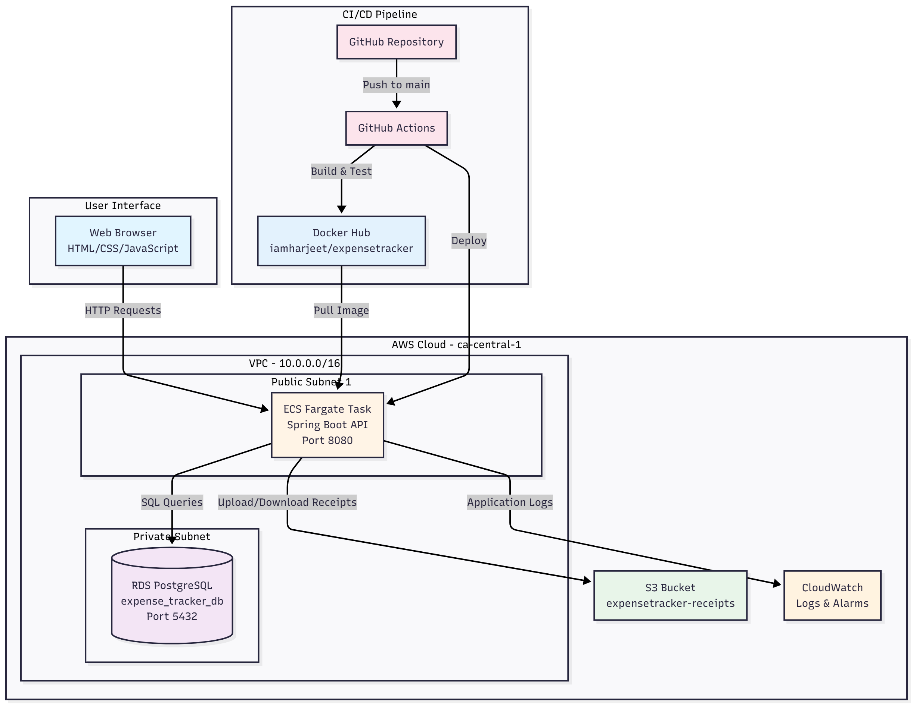
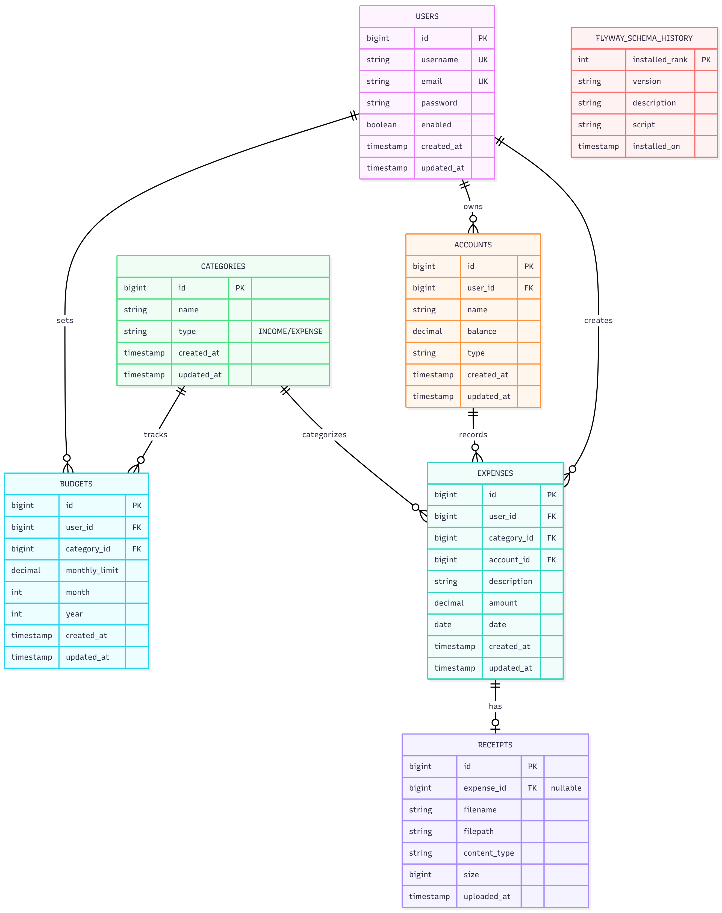

# Cloud-Native Expense Tracker

A full-stack expense tracking application built with Java Spring Boot, PostgreSQL, and AWS cloud infrastructure. This portfolio project demonstrates enterprise-grade backend development, cloud-native architecture, and modern DevOps practices.

## 🚀 Features
- **User Authentication** - JWT-based secure login and registration
- **Expense Management** - Track income and expenses with pagination, filtering, and search
- **Category & Account Management** - Organize transactions with custom categories and multiple accounts
- **Budget Tracking** - Set monthly budgets with real-time spent tracking and over-budget alerts
- **Receipt Storage** - Upload and securely store receipts in AWS S3
- **Reports & Analytics** - Monthly financial summaries with top spending categories
- **CSV Export** - Export expense data with date range filtering
- **API Documentation** - Interactive Swagger UI for all REST endpoints
- **Cloud Deployment** - Fully automated CI/CD pipeline deploying to AWS ECS Fargate
- **Database Migrations** - Version-controlled schema with Flyway

## 🛠️ Tech Stack

### Backend
- **Java 21** - Modern Java with records and enhanced features
- **Spring Boot 3.x** - Core framework with Spring Web, Data JPA, Security
- **Spring Security + JWT** - Stateless authentication with access tokens
- **PostgreSQL** - Primary database with Flyway migrations
- **Maven** - Build automation and dependency management

### Frontend
- **HTML5/CSS3/JavaScript** - Responsive single-page application
- **Fetch API** - RESTful API integration

### Cloud & Infrastructure
- **AWS ECS Fargate** - Serverless container orchestration
- **AWS RDS PostgreSQL** - Managed database with automated backups
- **AWS S3** - Object storage for receipt files
- **AWS CloudWatch** - Centralized logging and monitoring with alarms
- **AWS IAM** - Role-based access control for services

### DevOps & Tools
- **Docker** - Containerization with multi-stage builds
- **Terraform** - Infrastructure as Code (28+ AWS resources)
- **GitHub Actions** - Automated CI/CD pipeline
- **Docker Hub** - Container registry
- **Swagger/OpenAPI** - API documentation

## 📐 Architecture

### System Architecture


The application follows a cloud-native microservices architecture with:
- **Frontend** serving static HTML/CSS/JS from Spring Boot
- **REST API** handling all business logic with layered architecture
- **PostgreSQL RDS** for persistent data storage
- **S3** for scalable file storage
- **ECS Fargate** for serverless compute
- **CloudWatch** for observability

### Database Schema


The database consists of 7 tables with proper foreign key relationships:
- **users** - User accounts with authentication
- **categories** - Income/expense categories (pre-populated with 12 defaults)
- **accounts** - User financial accounts (cash, bank, credit card)
- **expenses** - Transaction records with category and account linkage
- **budgets** - Monthly budget limits per category
- **receipts** - File metadata for uploaded receipts
- **flyway_schema_history** - Database version control

## 🏃‍♂️ Getting Started

### Prerequisites
- Java 21+
- Docker Desktop
- Maven 3.8+
- Git
- AWS Account (for cloud deployment)
- Terraform 1.0+ (for infrastructure)

### Local Development

#### Option 1: Docker Compose (Recommended)
```bash
# Clone the repository
git clone https://github.com/iamharjeet/expensetracker.git
cd expensetracker

# Start PostgreSQL and Application
docker-compose up

# Access the application
open http://localhost:8080
```

#### Option 2: Manual Setup
```bash
# Start PostgreSQL only
docker-compose up postgres

# Run Spring Boot application
./mvnw spring-boot:run

# Access the application
open http://localhost:8080
```

### First Time Setup
1. Register a new user at `/register.html`
2. Login with your credentials at `/login.html`
3. Create accounts and categories
4. Start tracking expenses!

## 📚 API Documentation

Interactive API documentation available at:
```
http://localhost:8080/swagger-ui.html
```

### Key Endpoints
- **Authentication**: `POST /api/auth/register`, `POST /api/auth/login`
- **Users**: `GET/POST/PUT/DELETE /api/users`
- **Expenses**: `GET/POST/PUT/DELETE /api/expenses` (with pagination & filtering)
- **Categories**: `GET /api/categories`
- **Accounts**: `GET/POST/PUT/DELETE /api/accounts`
- **Budgets**: `GET/POST/PUT/DELETE /api/budgets`
- **Receipts**: `POST /api/receipts/upload`, `GET /api/receipts/{id}/url`
- **Reports**: `GET /api/reports/monthly-summary`, `GET /api/reports/export-csv`

## 🚀 Deployment

### AWS Infrastructure
The application is deployed on AWS using Terraform-managed infrastructure:
- **Region**: ca-central-1 (Canada - Montreal)
- **Compute**: ECS Fargate (serverless containers)
- **Database**: RDS PostgreSQL (db.t3.micro)
- **Storage**: S3 with encryption and lifecycle policies
- **Networking**: VPC with public subnets
- **Monitoring**: CloudWatch with 5 active alarms

### CI/CD Pipeline
Automated deployment via GitHub Actions:
1. **Build** - Maven compiles Spring Boot application
2. **Docker** - Build and push image to Docker Hub
3. **Deploy** - Update ECS Fargate service with new image

**Trigger**: Push to `main` branch automatically deploys to production

**Deployment time**: ~7-12 minutes

### Deployment Guide
See detailed deployment instructions in [docs/deployment-runbook.md](docs/deployment-runbook.md)

**Quick deploy:**
```bash
# Deploy infrastructure
cd terraform
terraform init
terraform apply

# Deploy application (automated via GitHub Actions)
git push origin main
```

## 📁 Project Structure
```
expensetracker/
├── src/main/
│   ├── java/com/harjeet/expensetracker/
│   │   ├── auth/              # Authentication (login, register)
│   │   ├── config/            # Configuration (Security, AWS S3, OpenAPI)
│   │   ├── controller/        # REST API controllers (8 controllers)
│   │   ├── dto/               # Data Transfer Objects
│   │   ├── exception/         # Global exception handling
│   │   ├── model/             # JPA entities (7 entities)
│   │   ├── repository/        # Spring Data repositories
│   │   ├── security/          # JWT authentication & filters
│   │   └── service/           # Business logic layer
│   └── resources/
│       ├── db/migration/      # Flyway SQL migrations (7 migrations)
│       ├── static/            # Frontend (HTML/CSS/JS)
│       └── application.properties
├── terraform/                 # Infrastructure as Code (12 .tf files)
├── .github/workflows/         # CI/CD pipeline (deploy.yml)
├── docs/
│   ├── architecture/          # Architecture diagrams
│   └── deployment-runbook.md  # Deployment guide
├── Dockerfile                 # Multi-stage Docker build
├── docker-compose.yml         # Local development setup
├── PROGRESS.md               # Detailed development progress
└── README.md                 # This file
```

## 📸 Screenshots

### Login Page
*[Screenshot placeholder - Login interface with JWT authentication]*

### Expenses Dashboard
*[Screenshot placeholder - Expense list with pagination, filtering, and search]*

### Reports & Analytics
*[Screenshot placeholder - Monthly summary with top spending categories and CSV export]*

## 🔐 Security Features
- **JWT Authentication** - Stateless token-based auth with access tokens
- **Password Encryption** - BCrypt hashing for user passwords
- **HTTPS Ready** - Application configured for TLS (currently HTTP on port 8080)
- **IAM Roles** - ECS tasks use IAM roles (no hardcoded AWS credentials)
- **S3 Security** - Pre-signed URLs with 15-minute expiration
- **Database Encryption** - RDS encryption at rest enabled
- **Security Groups** - Network isolation with least-privilege access
- **Input Validation** - DTO validation for all API endpoints

## 📊 Monitoring & Observability
- **Application Logs** - CloudWatch log group `/ecs/expensetracker-dev`
- **CloudWatch Alarms** - 5 alarms (ECS CPU/Memory, RDS CPU/Connections/Storage)
- **Health Checks** - Spring Boot Actuator endpoint `/actuator/health`
- **CloudWatch Dashboard** - Real-time metrics visualization
- **Flyway Migrations** - Version-controlled database schema

## 🧪 Testing
Testing framework configured with:
- JUnit 5
- Mockito
- Spring Boot Test
- Testcontainers support (for integration tests)

*Note: Comprehensive test suite deferred to post-MVP phase due to deadline constraints*

## 🚧 Future Enhancements
Features skipped in MVP that could be added later:
- **Email Notifications** - Welcome emails, budget alerts, monthly reports (using AWS SES)
- **Dashboard with Charts** - Visual analytics with Chart.js (pie charts, line graphs)
- **Password Reset Flow** - Email-based password reset with token validation
- **Email Verification** - User activation via email verification links
- **Application Load Balancer** - Stable DNS endpoint (currently using dynamic ECS IP)
- **HTTPS/SSL** - Custom domain with SSL certificate
- **Multi-AZ RDS** - High availability with automatic failover
- **Comprehensive Testing** - Unit tests, integration tests with Testcontainers (80%+ coverage)
- **Mobile App** - React Native or Flutter mobile client
- **Shared Budgets** - Multi-user budget collaboration for families/roommates
- **Receipt OCR** - Automatic expense extraction from receipt images
- **Auto-categorization** - ML-based transaction categorization

## 💰 Cost Optimization
**AWS Free Tier (First 12 months)**: $0/month
- ECS Fargate: 750 hours/month
- RDS db.t3.micro: 750 hours/month
- S3: 5GB storage
- CloudWatch: 10 alarms, 10 metrics

**After Free Tier**: ~$19-20/month
- Can reduce costs by stopping ECS service when not in use

## 📝 Project Status
✅ **Completed**: Step 24 of 25 (96% complete)

🚀 **Current Step**: Step 25 - Production Readiness & Documentation

See [PROGRESS.md](PROGRESS.md) for detailed step-by-step progress tracking.

## 📖 Documentation
- **API Documentation**: [Swagger UI](http://localhost:8080/swagger-ui.html)
- **Deployment Guide**: [docs/deployment-runbook.md](docs/deployment-runbook.md)
- **Architecture Diagrams**: [docs/architecture/](docs/architecture/)
- **Progress Tracking**: [PROGRESS.md](PROGRESS.md)

## 🤝 Contributing
This is a portfolio project. Contributions, issues, and feature requests are welcome!

## 👨‍💻 Author
**Harjeet Singh**
- GitHub: [@iamharjeet](https://github.com/iamharjeet)
- Project Repository: [expensetracker](https://github.com/iamharjeet/expensetracker)

## 📄 License
This project is licensed under the MIT License - see the LICENSE file for details.

---

**Built with ☕ and ☁️ - A portfolio project demonstrating full-stack development, cloud architecture, and DevOps practices**